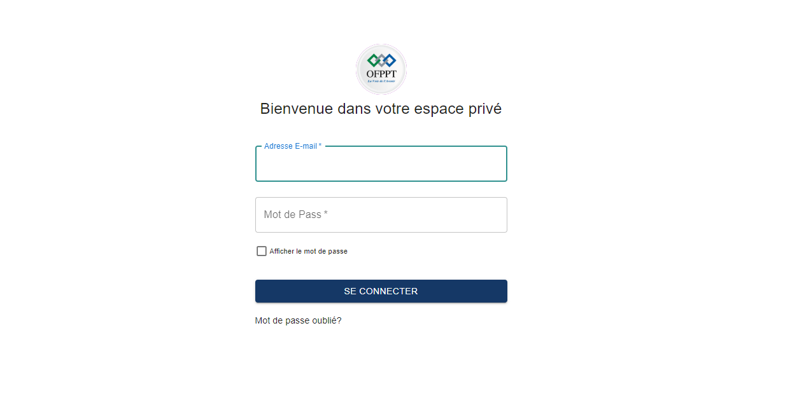
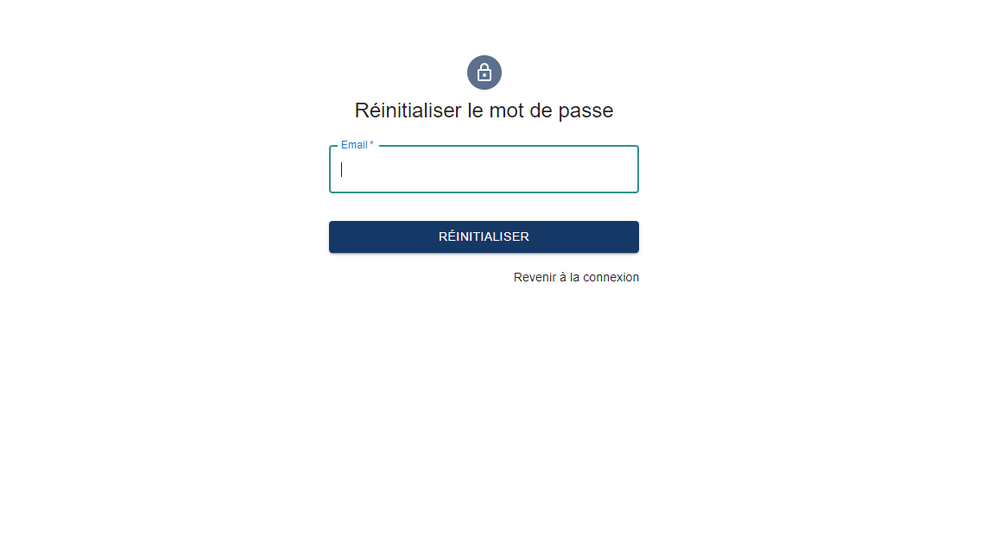
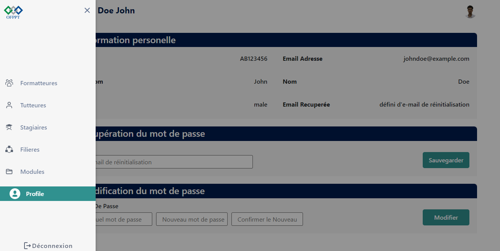
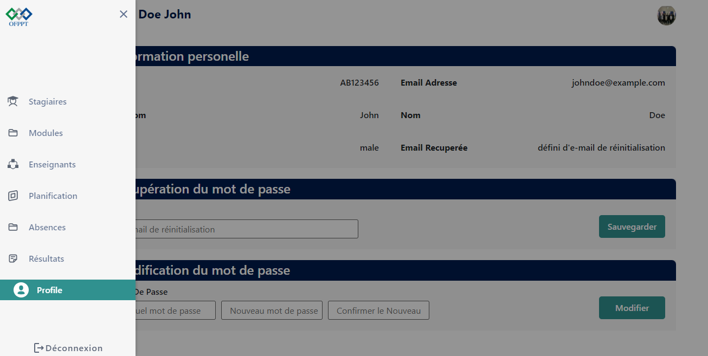
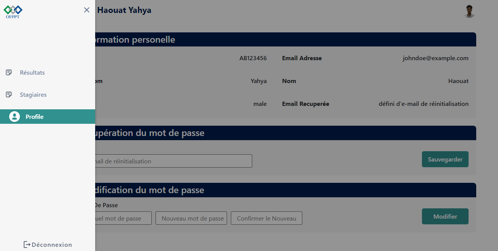
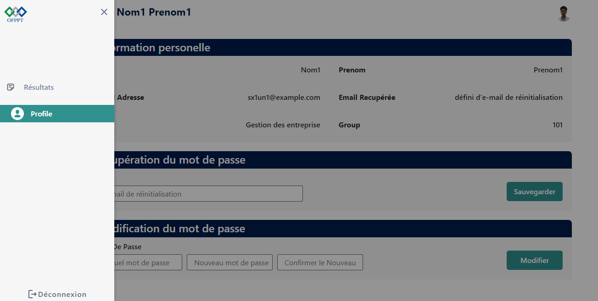

# StagiNotes 
  This is my PFE(end of study project) project in of Ofppt(Office for Skills Training and the Promotion of Work) , which is about of a web application programmed for the students , the teachers and the administration . 
StagiNotes is a exam's results management give these following features:  
StagiNotes includes four types of users, each with specific functionalities:

### 1. Stagiaire (Trainee)
- View personal exam results.

### 2. Director
- Manage trainers (show, add, update, delete trainers).
- Manage tutors (show, add, update, delete tutors).
- Manage fields of study (show, add, update, delete fields).
- View trainees and their modules.

### 3. Formateur (Trainer)
- Fill in form data.
- View trainees under their supervision.
- Record and store exam results.
- Retrieve and display notes for trainees.
- View specific trainee exam results.

### 4. Tuteur (Tutor)
- View and manage trainees (show, add, update, delete trainees).
- Manage modules (show, add, update, delete modules).
- Manage trainer-field-module assignments (show, add, update assignments).
- Assign trainees to modules.
- Record trainee absences.
- View exam results of assigned trainees.

## Tech Stack
StagiNotes is built using modern web technologies:

- **Frontend:** React.js with Material-UI (MUI) and custom CSS for styling.
- **Backend:** Laravel framework with Sanctum authentication for secure user access.
- **Design:** Figma was used to create the initial sketches and UI design.

## StagiNotes ScreenShots
### Login Form

### Reset Password Input

### Home Page

### Director Dashboard

### Tuteur Dashboard

### Formateur Dashboard

### Stagiaire Dashboard

# Getting Started with Create React App

This project was bootstrapped with [Create React App](https://github.com/facebook/create-react-app).

## Available Scripts

In the project directory, you can run:

### `npm start`

Runs the app in the development mode.\
Open [http://localhost:3000](http://localhost:3000) to view it in your browser.

The page will reload when you make changes.\
You may also see any lint errors in the console.

### `npm test`

Launches the test runner in the interactive watch mode.\
See the section about [running tests](https://facebook.github.io/create-react-app/docs/running-tests) for more information.

### `npm run build`

Builds the app for production to the `build` folder.\
It correctly bundles React in production mode and optimizes the build for the best performance.

The build is minified and the filenames include the hashes.\
Your app is ready to be deployed!

See the section about [deployment](https://facebook.github.io/create-react-app/docs/deployment) for more information.

### `npm run eject`

**Note: this is a one-way operation. Once you `eject`, you can't go back!**

If you aren't satisfied with the build tool and configuration choices, you can `eject` at any time. This command will remove the single build dependency from your project.

Instead, it will copy all the configuration files and the transitive dependencies (webpack, Babel, ESLint, etc) right into your project so you have full control over them. All of the commands except `eject` will still work, but they will point to the copied scripts so you can tweak them. At this point you're on your own.

You don't have to ever use `eject`. The curated feature set is suitable for small and middle deployments, and you shouldn't feel obligated to use this feature. However we understand that this tool wouldn't be useful if you couldn't customize it when you are ready for it.

## Learn More

You can learn more in the [Create React App documentation](https://facebook.github.io/create-react-app/docs/getting-started).

To learn React, check out the [React documentation](https://reactjs.org/).

### Code Splitting

This section has moved here: [https://facebook.github.io/create-react-app/docs/code-splitting](https://facebook.github.io/create-react-app/docs/code-splitting)

### Analyzing the Bundle Size

This section has moved here: [https://facebook.github.io/create-react-app/docs/analyzing-the-bundle-size](https://facebook.github.io/create-react-app/docs/analyzing-the-bundle-size)

### Making a Progressive Web App

This section has moved here: [https://facebook.github.io/create-react-app/docs/making-a-progressive-web-app](https://facebook.github.io/create-react-app/docs/making-a-progressive-web-app)

### Advanced Configuration

This section has moved here: [https://facebook.github.io/create-react-app/docs/advanced-configuration](https://facebook.github.io/create-react-app/docs/advanced-configuration)

### Deployment

This section has moved here: [https://facebook.github.io/create-react-app/docs/deployment](https://facebook.github.io/create-react-app/docs/deployment)

### `npm run build` fails to minify

This section has moved here: [https://facebook.github.io/create-react-app/docs/troubleshooting#npm-run-build-fails-to-minify](https://facebook.github.io/create-react-app/docs/troubleshooting#npm-run-build-fails-to-minify)
